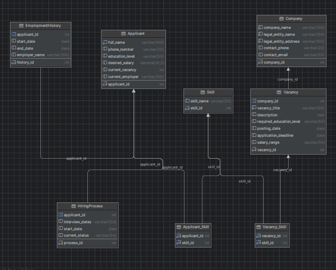

## <p class="center" id="title1" > **Информационная система для автоматизации их работы специалистов по подбору персонала**</p>

##Изобразим схему
инфологической модели 

<p align="center">
 
</p>

### Настраиваем базу данных MySQL

```mysql
create database profi_db;
use profi_db;

CREATE TABLE Company (
                         company_id INT PRIMARY KEY AUTO_INCREMENT,
                         company_name VARCHAR(100) NOT NULL,
                         legal_entity_name VARCHAR(100) NOT NULL,
                         legal_entity_address VARCHAR(100) NOT NULL,
                         contact_phone VARCHAR(20),
                         contact_email VARCHAR(50)
);

CREATE TABLE Vacancy (
                         vacancy_id INT PRIMARY KEY AUTO_INCREMENT,
                         company_id INT,
                         vacancy_title VARCHAR(100) NOT NULL,
                         description TEXT,
                         required_education_level VARCHAR(50),
                         posting_date DATE,
                         application_deadline DATE,
                         salary_range VARCHAR(50),
                         FOREIGN KEY (company_id) REFERENCES Company(company_id)
);

CREATE TABLE Skill (
                       skill_id INT PRIMARY KEY AUTO_INCREMENT,
                       skill_name VARCHAR(50)
);

CREATE TABLE Vacancy_Skill (
                               vacancy_id INT,
                               skill_id INT,
                               PRIMARY KEY (vacancy_id, skill_id),
                               FOREIGN KEY (vacancy_id) REFERENCES Vacancy(vacancy_id),
                               FOREIGN KEY (skill_id) REFERENCES Skill(skill_id)
);

CREATE TABLE Applicant (
                           applicant_id INT PRIMARY KEY AUTO_INCREMENT,
                           full_name VARCHAR(100) NOT NULL,
                           phone_number VARCHAR(20),
                           education_level VARCHAR(50),
                           desired_salary DECIMAL(10, 2),
                           current_vacancy INT,
                           current_employer VARCHAR(100),
                           UNIQUE (full_name)
);

CREATE TABLE Applicant_Skill (
                                 applicant_id INT,
                                 skill_id INT,
                                 PRIMARY KEY (applicant_id, skill_id),
                                 FOREIGN KEY (applicant_id) REFERENCES Applicant(applicant_id),
                                 FOREIGN KEY (skill_id) REFERENCES Skill(skill_id)
);

CREATE TABLE HiringProcess (
                               process_id INT PRIMARY KEY AUTO_INCREMENT,
                               applicant_id INT,
                               interview_dates VARCHAR(100),
                               start_date DATE,
                               current_status VARCHAR(50),
                               FOREIGN KEY (applicant_id) REFERENCES Applicant(applicant_id)
);

CREATE TABLE EmploymentHistory (
                                   history_id INT PRIMARY KEY AUTO_INCREMENT,
                                   applicant_id INT,
                                   start_date DATE,
                                   end_date DATE,
                                   employer_name VARCHAR(100),
                                   FOREIGN KEY (applicant_id) REFERENCES Applicant(applicant_id)
);
```
## Далее создадим набор тестовых данных
```mysql
-- Добавление данных в таблицу Company
INSERT INTO Company (company_name, legal_entity_name, legal_entity_address, contact_phone, contact_email)
VALUES ('Company A', 'Legal Entity A', 'Address A', '111-111-1111', 'emailA@example.com'),
       ('Company B', 'Legal Entity B', 'Address B', '222-222-2222', 'emailB@example.com');

-- Добавление данных в таблицу Vacancy
INSERT INTO Vacancy (company_id, vacancy_title, description, required_education_level, posting_date, application_deadline, salary_range)
VALUES (1, 'Data Analyst', 'Description C', 'Bachelor', '2022-02-01', '2022-03-01', '$50,000 - $70,000'),
       (1, 'Sales Manager', 'Description D', 'Bachelor', '2022-02-15', '2022-03-15', '$60,000 - $80,000'),
       (1, 'Software Engineer', 'Description A', 'Bachelor', '2022-01-01', '2022-02-01', '$60,000 - $80,000'),
       (1, 'Marketing Specialist', 'Description B', 'Bachelor', '2022-01-15', '2022-02-15', '$50,000 - $70,000'),
       (1, 'Graphic Designer', 'Description E', 'Associate', '2022-03-01', '2022-04-01', '$40,000 - $60,000');


-- Добавление данных в таблицу Skill
INSERT INTO Skill (skill_name)
VALUES ('Java'), ('SQL'), ('Marketing'), ('Communication');

-- Добавление данных в таблицу Vacancy_Skill
INSERT INTO Vacancy_Skill (vacancy_id, skill_id)
VALUES (1, 1),
       (1, 2),
       (2, 3);


-- Добавление данных в таблицу Applicant
INSERT INTO Applicant (full_name, current_vacancy)
VALUES ('Applicant 1', 1),
       ('Applicant 2', 1),
       ('Applicant 3', 2),
       ('Applicant 4', 2),
       ('Applicant 5', 3);

-- По аналогии добавляются данные в таблицы Applicant, Applicant_Skill, HiringProcess, EmploymentHistory
SELECT v.vacancy_title, COUNT(*) AS num_applicants
FROM Vacancy v
         JOIN Applicant a ON v.vacancy_id = a.current_vacancy
WHERE v.company_id = 1
GROUP BY v.vacancy_title
ORDER BY num_applicants DESC
LIMIT 5;

```
## После чего можем выполнить наш запрос к БД:

```mysql
-- Итоговый запрос
SELECT v.vacancy_title, COUNT(*) AS num_applicants
FROM Vacancy v
         JOIN Applicant a ON v.vacancy_id = a.current_vacancy
GROUP BY v.vacancy_id
ORDER BY num_applicants DESC
LIMIT 1;
```
